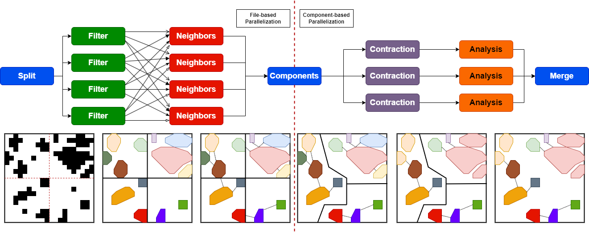

# Fishnet
*Framework for Graph-Based Analysis of GIS Vector Data*  
#### Table of Contents
- [Workflows](#workflows)
    - [Settlement Delineation and Analysis (SDA)](#settlement-delineation-and-analysis-sda)
        - [Deployment](#deployment)
        - [Development](#development)
    - [Africapolis (WiP)](#africapolis-wip)
        - [Installation](#installation)
        - [Running the Workflow](#running-the-workflow)
- [Framework](#framework)
    - [Architecture](#architecture)
    - [Installation](#installation-1)
    - [Framework Usage](#framework-usage)

# Workflows
## Settlement Delineation and Analysis (SDA)
Delineate urban clusters using a settlement graph and [edge contraction](https://en.wikipedia.org/wiki/Edge_contraction) and then analyze the centrality of the aggregated settlement clusters.  

.
### Deployment
To run the **Settlement Delineation and Analysis** workflow, the easiest way is to use [SettlementDelineationAnalysis.py](app/sda-workflow/SettlementDelineationAnalysis.py), which wraps the command line interface of the [main binary](app/sda-workflow/src/0_workflow/SettlementDelineation.cpp) and executes it in a container using [docker-compose](app/sda-workflow/compose.yaml) (which has to be installed in the deployment environment). 
```
python3 SettlementDelineationAnalysis.py -i <input> -c <config>.json -o <output>.shp
``` 
- **input**: Input GIS file (*GeoTIFF* | *Shapefile*) on settlement location (e.g. [WSF](https://geoservice.dlr.de/web/maps/eoc:wsf2019))
- **config**: JSON file containing the config for the workflow run (e.g. [Example Config](app/sda-workflow/sda-docker.json) )
- **output**: Path of output shapefile  

The input, config, intermediate and final result files will be mounted on the host system, which is by default: **${HOME}/.fishnet/**.
### Development
Alternatively the **SDA** workflow can be installed on the system using the [install](install.sh) script. Make sure that the install prefix location is referenced in *PATH* (e.g. *usr/local/bin*). 
```shell
./install.sh
```
Additionally, a cwl runner must be installed to execute the individual stages of the workflow. The reference executor [cwltool](https://cwltool.readthedocs.io/en/latest/cli.html#cwltool) is recommended and can be installed as follows:
```shell
sudo apt-get install cwltool
```
Furthermore, a running instance of the **Memgraph** database joined with the **Memgraph Lab** web interface can be obtained using docker compose:
```shell
cd prod/local
docker compose up -d
```
The workflow can then be executed as follows:
```shell
SettlementDelineation -i <path-to-input> -c <path-to-cfg> -o <path-to-output.shp>
```

## Africapolis (*WiP*)
In contrast, the [*Africapolis*](cwl/africapolis) Workflow is completely orchestrated with the [Common Workflow Language (CWL)](https://www.commonwl.org/user_guide/), with each stage being a command line program, composed using *Fishnet*.
### Installation
The required binaries of *Africapolis* currently have to be manually install on the system. This can be achieved with the [install](install.sh) script. Make sure that the install prefix location (*$INSTALL_PREFIX*) is referenced in *PATH* (e.g. *usr/local/bin*). 
```shell
./install.sh
```
Additionally, a [CWL Runner](https://www.commonwl.org/implementations/) must be installed to execute the workflow. The reference executor [cwltool](https://cwltool.readthedocs.io/en/latest/cli.html#cwltool) is recommended and can be installed as follows:
```shell
sudo apt-get install cwltool
```
### Running the Workflow
```
cwltool Africapolis.cwl <CWL-Job>.json
``` 

# Framework
## Architecture
The core framework contains generic components for the following domains:
- [Graph Model and Traversal](lib/core/graph)
- [Geometry Model and Sweep Line Algorithms](lib/core/geometry)
- [I/O for GIS files and Vector Datasets](lib/core/io)
- [Workflow Orchestration and Utility](lib/workflow)
## Installation
Before the library can be build using *cmake*, the **GDAL** and **SSL** libraries have to be installed on the machine. On Ubuntu-based system this can be achieved using the following command:
```shell
sudo apt-get install -y libgdal-dev libssl-dev
``` 
Then the project can be build as follows:
```shell
mkdir build
cd build
cmake ..
cmake --build . <add custom cmake parameters here>
```
## Framework Usage
The following example shows how to store polygons, obtained from a Shapefile, in a graph. Thereafter, the degree centrality measures is calculated on the graph and the results stored as features in the output shapefile.
```cpp
#include <fishnet/Fishnet.hpp>

using namespace fishnet;

int main() {
    using G = geometry::Polygon<double>;
    Shapefile input {"/path/to/file.shp"};
    auto inputLayer = VectorIO::read<G>(input);
    auto polygons = inputLayer.getGeometries();
    // scale aaBB of polygon by this factor; intersecting buffers -> adjacent
    double bufferMultiplier = 2; 
    size_t maximumNumberOfNeighbours = 5;
    auto adjacencies = geometry::findNeighbouringPolygons(polygons,bufferMultiplier,maximumNumberOfNeighbours);
    auto polygonGraph = graph::GraphFactory::UndirectedGraph<G>();
    polygonGraph.addEdges(adjacencies);
    // copy spatial reference from input layer
    auto resultLayer = VectorLayer<G>(inputLayer.getSpatialReference());
    auto degreeCentralityField = resultLayer.addSizeField("degCent").value_or_throw();
    for(const G & polygon: polygonGraph.getNodes()){
        Feature<G> feature {polygon};
        auto degreeCentrality = fishnet::util::size(polygonGraph.getNeighbours(polygon));
        feature.addAttribute(degreeCentralityField,degreeCentrality);
        resultLayer.addFeature(std::move(feature));
    }   
    Shapefile output = input;
    output.appendToFilename("_degree_centrality") ;
    VectorIO::overwrite(resultLayer, output);
}
```
To link the *Fishnet* framework to the program the following *CMake* file can be used:
```cmake 
add_executable(polygonGraph PolygonGraph.cpp)
target_link_libraries(polygonGraph PRIVATE Fishnet::Fishnet)
```


